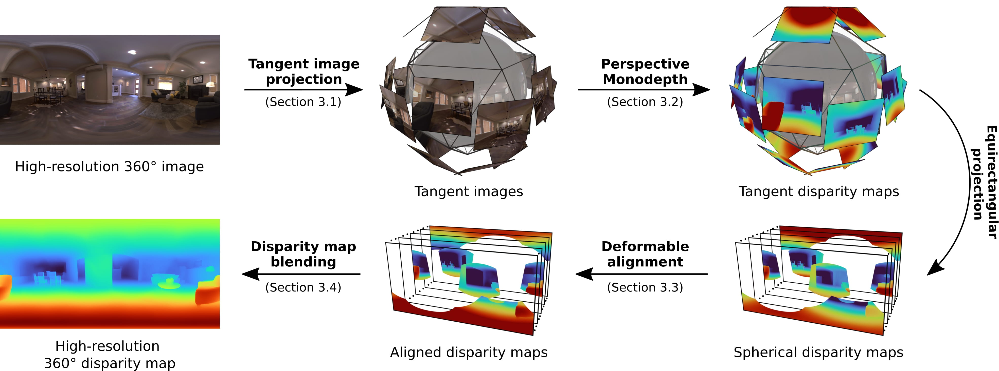

# 360MonoDepth
### [Paper](https://arxiv.org/abs/2111.15669) | [Project Page](https://manurare.github.io/360monodepth/)

This is the code for [360MonoDepth: High-Resolution 360° Monocular Depth Estimation](https://arxiv.org/abs/2111.15669)
 

 [Manuel Rey-Area](https://manurare.github.io/)\*,
 [Mingze Yuan](https://yuanmingze.github.io/)\*,
 [Christian Richardt](https://richardt.name/) <br>
 University of Bath  
  \*denotes equal contribution  
 __CVPR 2022__


## Setup

Tested with Python >= 3.8


Dependencies for C++ code:
 * Ceres 2.0.0
 * Eigen 3.3.9
 * Glog 0.5.0
 * Gflags 2.2.2
 * GTest 1.10.0
 * OpenCV 4.2.0
 * Boost 1.75.0
 * pybind11 2.8.1

Dependencies for python are in ```code/python/requirements.txt```


#### With Docker 
We recommend Docker to run 360MonoDepth to avoid problems with dependencies.
```
docker build -t 360monodepth .
docker run -it -v /home/a/ai-cluster/360monodepth/data:/monodepth/results/test_experiment 360monodepth sh -c "cd /monodepth/code/python/src; python3 main.py --expname test_experiment --grid_size 8x7 --data /monodepth/results/test_experiment/game.txt"
```

#### Without Docker 
1. We need to create a conda environment with python 3.8 and build the C++ targets

 
```
conda create -n 360monodepth python=3.8
conda activate 360monodepth
pip install -r code/python/requirements.txt
```

2. Build ```pybind11``` in ```code/cpp/3rd_party``` first (or ```apt-get install python3-pybind11```). Then, modify ```cmakeconfig``` and ```code/cpp/python/setup.py``` to add own paths to libraries/includes

```
cd code/cpp
mkdir build && cd build
cmake -DCMAKE_BUILD_TYPE=Release ../
make -j8
```
3. Copy all the dependent DLL/so files to ```code/cpp/python/[dll,so]```. For example, in Linux ```code/cpp/python/so``` should contain the following dynamic libraries: ```libamd.so.2, libcholmod.so.3, libglog.so, libm.so.6, libsuitesparseconfig.so.5, libblas.so.3, libcolamd.so.2, libglog.so.0, libopencv_core.so.4.2, libtbb.so.2, libcamd.so.2, libcxsparse.so.3, libgomp.so.1, libopencv_imgproc.so.4.2, libccolamd.so.2, libgflags.so.2.2, liblapack.so.3, libquadmath.so.0, libceres.so.2, libgfortran.so.5, libmetis.so.5, libspqr.so.2```

```
cd code/cpp/python
python setup.py build
python setup.py bdist_wheel
pip install code/cpp/python/dist/instaOmniDepth-0.1.0-cp38-cp38-linux_x86_64.whl
```

*OPTIONAL*: To add support for BoostingMonocularDepth
```
git submodule update --init
```
And download the required weights as indicated in their [README](https://github.com/compphoto/BoostingMonocularDepth#setup). 

## Running code
Always execute this command per new instance of shell. 

```
export LD_LIBRARY_PATH=$LD_LIBRARY_PATH:/path/to/conda/envs/360monodepth/lib/python3.8/site-packages/instaOmniDepth
```

Now, we can run the code!

```
cd code/python/src
python main.py --expname test_experiment --blending_method all --grid_size 8x7
```

### Data
Data must be provided with the ```--data``` flag and must be a ```.txt``` file with the following structure:

```
/path/to/dataset/filename00_rgb.[png,jpg] /path/to/dataset/filename00_depth.dpt
/path/to/dataset/filename01_rgb.[png,jpg] /path/to/dataset/filename01_depth.dpt
		.				          .
		.				          .
		.				          .
```
An example can be found at ```data/erp_00_data.txt```.
In case of using data without GT, ```None``` should be written in the second column. 
## Citation

```
@inproceedings{reyarea2021360monodepth,
	title={{360MonoDepth}: High-Resolution 360{\deg} Monocular Depth Estimation},
	author={Manuel Rey-Area and Mingze Yuan and Christian Richardt},
	booktitle={CVPR},
	year={2022}}
```
