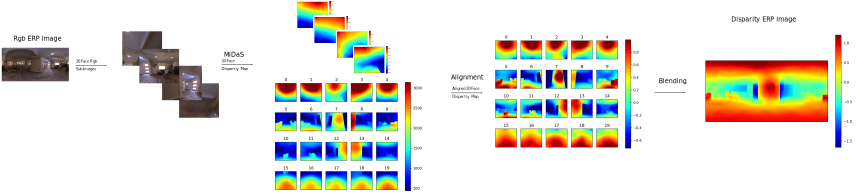
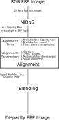
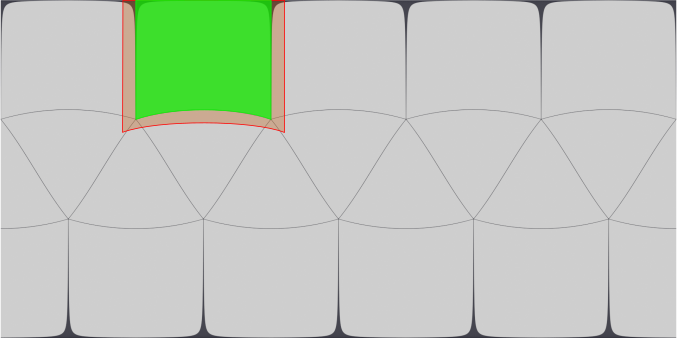
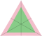

# 1. Introduction

1. Panoramic image is common, but shortage publiced labeled data.how to hire the on the shelf per-trained perspective image input method to solve the 
2. The previous (Monocular) use :
    - [ ] what are our method advantages?
3. Our method contributions:
   -  Have good performance in high resolution images?
   -  Good performance at output door scene?


# 2. Related Work

- the kernel transform CNN \cite{xxx} which generate the , but their method can not unformed sample the ERP image, over sample at the pole. 
- Twist the Icosahedron sub-image and CNN's weight to ~\cite{zhang2019orientation};
    But the interpolation of CNN weight to introduce the ERROR. ~\cite{xxx}. 

# 3. Method

<p align="center">

<figcaption>Fig.1 - method_pipeline_0</figcaption>
</p>

<p align="center">

<figcaption>Fig.2 - method_pipeline_1</figcaption>
</p>

The pipeline use the equirectangular format panoramic image by default, but it also can use on others panoramic image format.
The method compose with 5 steps:
1. Sub-image extraction: Projection the equirectangular (ERP) image to tangent space to generate perspective images;
1. Use on-the shelf monocular disparity map method to estimate depth map, e.g. MiDaS. MiDaS is the backbone of single perspective RGB image disparity map estimation method, which achieves the-state-of-art performance in both indoor and outdoor scene.
1. Disparity Map Alignment: Alignment the sub-images disparity map. the monocular disparity map \cite{xxx} ambiguity problem, to align all sub-image's disparity map in same range;
1. Stitching the aligned sub-images disparity maps.

**Table-1**. Notation
| Notation    | Expression |
| :---:       |  :----:   | 
| $I$         | The equritangular RGB image.| 
| $D$         | The equritangular Disparity map. $D_{blending}$ is the final blending disparity map. $D_{ij}$ is the $D$ disparity value at $(i,j)$ pixel. | 
| $D'$    | The equritangular ground truth disparity map. |
|    $n$      | The extracted perspective images (sub-image) index, $n \in [0,19]$|
| $I_{n}$     | The $n$th sub-images's RGB image.| 
| $D_{n}$     | The $n$th sub-image's disparity map. |
| $T_{n}$     | The sub-image's tangent point coordinate in spherical coordinate.  $(\theta_0, \phi_0)$|
| $T'_{n}$    | The sub-image's tangent point coordinate in tangent plane coordinate. |
| $M_s$         | The spherical coordinate of a point on the surface of unit sphere $(\theta, \phi)$, Spherical coordinate, $\theta \in [0, 2\pi)$, $\phi \in [-\frac{\pi}{2}, \frac{\pi}{2}]$ |
| $M_c$         | The Cartesian coordinate of a point in the Cartesian coordinate system $(x, y, z)$|
| $M'_{n}$      |  A point's coordinate is in $n$th tangent plane. $(x'_n,y'_n)$ |

## 3.1. Sub-images Extraction
- [ ] How to select the sampling direction to uniformed sample the ERP image, and avoid over-sample and under-sample ERP image?

Equirectangular format is most common panoramic image format, but there is dramatic distortion at the top and bottom of ERP image, which is the big barrier to prevent the state of art CNN method work on it. And the distortion is also the disadvantage of other panoramic image format, e.g. ~\cite{xxxxx}

To uniform sample the panoramic image, 
generate overlap area for disparity map alignment,
and *keep high fidelity (image structure) ~\cite{xxxx}*,
in the sub-images extraction process, the gnomonic projection is used to consistently extract padded subimage with platonic solids (icosahedron) sampling point.

### 3.1.1. Tangent Image Projection

- [ ] The padding equation or character? padding size vs Fov vs Sub-division. The Equation between the FoV and projected plane.
- [ ] What is the tangent image size? The relation with the ERP image resolution.

<p align="center">



<figcaption>Fig. Gnomonic projection, show 1) how to extract the perspective sub-images. 2) how to padding, 3) the relationship between spherical coordiante and tangent plane's, 4) </figcaption>
</p>

The gnomonic projection is used to extract plane image from equrictangular image with specified center point  $T_n$, which is the point of inscribed regular icosahedron. ~\cite{xxx}

The advantages of gnomonic projection:
1. Map the sphere's geodesic line to stright line in projected plane.
2. Convert the points from sphere surface to perspective images directly, without any intermediate transformation;
3. The perspective image have same unit (metric) with unit sphere;


**Gnomonic projection**

Gnomonic Projection transform pixels location between the unit spherical coordinate system $M_s$ and perspective image normalized coordinate $M'_n$. 

In the projection, the plane tangent point $P_t$ is $P_{ts}= (\theta_0, \phi_0)$ in spherical coordinate and $P_{tt} = {(x_0, y_0)}$ in tangent plane which origin is the plane's tangent point (center).

The gnomonic projection converting the points from spherical coordinate expression $P_{is} = (\theta, \phi)$ to tangent plane expression $P_{it} = {(x, y)}$ are:

$$
\begin{aligned}
x &=\frac{\cos \phi \sin \left(\theta-\theta_{0}\right)}{\cos c} \\
y &=\frac{\cos \phi_{0} \sin \phi-\sin \phi_{0} \cos \phi \cos \left(\theta-\theta_{0}\right)}{\sin \phi_{0} \sin \phi+\cos \phi_{0} \cos \phi \cos \left(\theta-\theta_{0}\right)},
\end{aligned}
\tag{1}
$$

The inverse gnomonic projection, which transform the tangent plane coordinate points $P_t = (x,y)$ to spherical coordiante:

$$
\begin{array}{l}
\rho=\sqrt{x^{2}+y^{2}} \\
c=\tan ^{-1} \rho \\
\phi=\sin ^{-1}\left(\cos c \sin \phi_{1}+\frac{y \sin c \cos \phi_{1}}{\rho}\right) \\
\theta=\theta_{0}+\tan ^{-1}\left(\frac{x \sin c}{\rho \cos \phi_{1} \cos c-y \sin \phi_{1} \sin c}\right)
\end{array}
$$

**Padding**

The padding size dilate the available area of each subimage, \cite{wang2020bifuse}, 
There are not overlap area between two neighbour faces of regular icosadron, for dilation
https://homepages.inf.ed.ac.uk/rbf/HIPR2/dilate.htm

Padding at tangent plane with gnomonic projection.

### 3.1.2. Projection Tangent Points

- [ ] Do we need sub-division? If yes which sub-division should use?
- [ ] A diagram show icosahedron is best, and \cite{pozo2019integrated}

The tangent points decide which area we will sample from the ERP image, how many sub-image extract.
To uniformed extract perspective images from equrictangular image, and avoid over-sample and under-sample the ERP image. \cite{xxx}
Furthermore, the 

**Icosahedron**

The regular icosahedron's (platonic polyhedra's) uniform geodiesic grid compose with 20 faces.
The tangent points of subimage is the inscribed point of Icosahedron. \cite{xxx}

**Sub-division**

$N = 20(4^b)$

## 3.2. Disparity map alignment

The MiDaS estimated disparity map have following problems:
- The subimages disparity map is scale and range are ambiguous. 

The MiDaS estimated each RGB subimages disparity map separately, which can not dic make the disparity map introduce anbigulity.
Before stitch them together, make them in a consisent and uniform scale and range.

### 3.2.1. Perspective Depth to Panoramic Depth

Convert the perspective disparity map to radian disparity map, MiDaS estimate 

Perspective disparity map & radiant disparity map


<p align="center"></p>

Equrictangular depth map is radian depth map, whose each pixel value is the distant from the origin to the 3D point $M_c$.

But the estimated sub-image's disparity map is the distant from the $Plane_{xy}$ to $M_c$.

So before align all the subimages depth map $D_n$ to uniformed scale and offset, need transform the MiDaS depth map from perspective projection to equrictangular depth map $D$.

$$
\frac{M'_n(y)}{M_c(y)} = \frac{M'_n(x)}{M_c(x)} = \frac{\sqrt{1 + M'_n(x)^2 + M'_n(y)^2}}{M_c(z)} =\frac{1}{M_c(z)}
$$


```
**Comment**:
The MiDaS output disparity is perspective disparity map, which in each camera own coordinate system.

There are two solutions:

- Before alignment the disparity map we need convert all disparity or depth map into a unified space, ERP's depth/disparity map space. So, we convert all of them to ERP's disparity map coordinate system, which depth value is distance from origin point to the 3D point and not relevant with the sub-image's camera pose.

- In the alignment, transform the point from src camera coordinate system to target coordinate system.

The code use the 1st solution, convert to ERP disparity map space before alignment.

The python code generate the corresponding relationship of two tangent image.

```


### 3.2.2. Sub-images Disparity Maps Alignment

- [ ] How much the pixels corresponding should use, use all corresponding relationship or just the neightbour relationship?

Subimage's spherical coordinate system location, and project to another sub-image with gnomonic projection, to get the pixels corresponding relationship;

Sub-image group alignment

$$
\underset{\left\{\hat{s}_{A}^i, \hat{o}_{A}^i\right\}}{\operatorname{argmin}} E_{\text {reprojection }}+\lambda_{1} E_{\text {smoothness }}+\lambda_{2} E_{\text {scale }}
$$

Reprojection Term:

The pixel corresponding:

ico_face_index_pixel_corresponding.svg

$$
E_{\text {reprojection }}=\sum_{ M_{A} \in {M}}\sum_{ M_{B} \in {M}}\sum_{\left(p_{A}^{i}, p_{B}^{i}\right)\in (M_{A}, M_{B})} \rho \left( \left\| s_{A}(p_{A}^{i}) d_{A}(p_{A}^{i}) + o_{A}(p_{A}^{i})- s_{B}(p_{B}^{i}) d_{B}(p_{B}^{i}) - o_{B}(p_{B}^{i})\right\|_{2}^{2} \right)
$$

Smooth Term

$$
E_{\text {smoothness }}=\sum_{M_A \in M} \sum_{(i, j) \in N(M_A)}\left\|\hat{s}_{A}^{i}-\hat{s}_{A}^{j}\right\|_{2}^{2}+\left\|\hat{o}_{A}^{i}-\hat{o}_{A}^{j}\right\|_{2}^{2}
$$

Scale Term
- [ ] Redesign.
- [ ] Compare the result of fixed 7 face and not.
$$
E_{\text {scale }}=\sum_{M_A \in M} \sum_{i}\left(\hat{s}_{A}^{i}\right)^{-1}
$$


**Multi-Resolution**

The sub-image disparity maps aligment coefficients grid use multi-resolution, 

- [ ]  Image Multi-resultion
- [ ]  Coefficients multi-resolution

<!-- <p align="center"></p> -->

## 3.3. Sub-images Disparity Maps Blending

- [ ] Diagram show the bilinear blending the gradient base blending;
- [ ] How to solver the Equation? Reference Original Paper.

<!-- $$
\underset{\mathbf{G}}{\arg \min } \lambda_{g} \sum_{\mathbf{x} \in \mathbb{N}} \sum_{i=1}^{20} w_{i}\left(\nabla \mathbf{G}(\mathbf{x})-\nabla \mathbf{D}_{i}(\mathbf{x})\right)+\lambda_{f} \sum_{\mathbf{x} \in \mathbb{N}}(\mathbf{G}(\mathbf{x})-\mathbf{C}(\mathbf{x}))
$$ -->

$$
\arg \min A_\mathbf{G} \lambda_g\sum_{\mathbf{x}}\sum_{i=1}^{20}w_i\left\lVert\nabla \mathbf{G}(\mathbf{x}) - \nabla \mathbf{D}_i(\mathbf{x})\right\rVert + \lambda_f\sum_{\mathbf{x}}\left\lVert\mathbf{G}(\mathbf{x}) - \mathbf{C}(\mathbf{x}) \right\rVert
$$

$\omega_i$  are the blend weights from the frustum blend weights which I create [here](https://github.bath.ac.uk/cr623/InstaOmniDepth/blob/0f417aee03d8182ca3b37a05009d6896d247fb14/code/python/src/utility/blending.py#L268).

$\lambda_g$ is 1,
$\lambda_f$  is 1,
$G$ is the final blended image that minimize that problem.

# 4. Experiment

## 4.1. Implementation

**Solver**

- [ ] Ceres Solver option 
- [ ] The times consuming of each step with 1k resolution. 

**MiDaS Best Practice**

- [ ] Diagram show which is the FoV and resolution to make MiDaS have the best performance

**Terms Weight**

- [ ] Search & diagram search the best terms weights;
- [ ] Diagram of searching the best padding size;
- [ ] Diagram of searching the blending term weight.

## 4.2. Dataset & Metric

### 4.2.1. Dataset

- [ ] How to render synthesizing Dataset
- [ ] How to use the OpenMVG's result?

**Table 5. Datasets.**
| Dataset     | Resolution|Scene Number| Comment | 
| :---        |  :----:   |  :----:    |:----:    |
| 3D60        | 512 x 256 |            | Indoor/     | 
| SceneNet    | ??        |            | Indoor/CG/Rendering         | 
| MatterPort3D| 2K        |            | Indoor/Real world/Rendering     | 
| Replica360  | 2K        |            | Indoor/Real world/Rendering    | 
| OmniPhoto   | 2K        |            | Outdoor/Real world/SFM, use soft mask to remove the invalided pixels. | 

### 4.2.2. Metric

- [ ] The real world dataset do not have ground truth, use wrap / MVG to metric error?
- [ ] How to Metric on sparse disparity map, in-paint or use mask?

## 4.3. Result

**Table-2. The Methods need compare.**
| Method     | Comment    | Code| 
| :---       |  :----:    |:----: |
| OmniDepth  | OmniDepth: Dense Depth Estimation for Indoors Spherical Panoramas. | No |
|  BiFuse    |                                                                   |  Yes |

### 4.3.1. Quantitative

**Table-3. Error.**
| Method     | Error | Comment| 
| :---       | :----: |:----: |
| OmniDepth  |        |       |
|  BiFuse    |        |       |

- [ ] Compare the smooth connection term's edge, add all corresponding relationship with just neighbour's connection;

Since the estimated monocular disparity map has ambiguous scale, before compute the error we use ~\cite{zioulis2018omnidepth} to scale $D$ make it have same median with the $D'$.

$\bar{s} = median(D)/median(D')$

The \cite{eigen2014depth}'s error metric. 
$y_i \in D$ and $y^*_i \in D'$ is the indexed $i$ pixel disparity value of disparity map, $i \in [0, |D|-1]$:
- Threshold ($\delta_{thr}$): $\%$ of $D$ s.t. $\max \left(\frac{y_{i}}{y_{i}^{*}}, \frac{y_{i}^{*}}{y_{i}}\right)=\delta<thr$
- Abs Relative Difference (ARD): $\frac{1}{|D|} \sum_{i=0}^{|D|}\left|y_i-y^{*}_i\right| / y^{*}_i$
- Squared Relative Difference: $\frac{1}{|D|} \sum_{i=0}^{|D|}|| y_i-y^{*}_i||^{2}_2 / y^{*}_i$
- RMSE (linear): $\sqrt{\frac{1}{|D|} \sum_{i=0}^{|D|}|| y_{i}-y_{i}^{*}||^{2}_2}$
- RMSE (log): $\sqrt{\frac{1}{|D|} \sum_{i=0}^{|D|}\left\|\log y_{i}-\log y_{i}^{*}\right\|^{2}_2}$
- RMSE (log, scale-invariant): $\frac{1}{|D|} \sum_{i=0}^{|D|}(\log y_{i}-\log y_{i}^{*} + \alpha(D, D'))$ and $\alpha(D, D') = \frac{1}{|D|} \sum_{i=0}^{|D|}(\log y_{i}-\log y_{i}^{*})$

To visualize the error of each pixel, define the error map of disparity map.
- Threshold $\delta_{thr}$ map:
- Abs Relative Difference map:
- Squared Relative Difference:
- RMSE (linear) map:
- RMSE (log) map:
- RMSE (log, scale0invariant):


### 4.3.2. Qualitative

- [ ] Image array of different methods and different dataset;
- [ ] show the colored 3D point;
- [ ] show the warped result with MVG.
- [ ] Show the Error map of aligned dispariy map;

## 4.4. Ablation study

- [ ] Multi-resolution, diagram show which is the best coefficients grid size.
- [ ] W/O the sub-image blending, compare with linear blending;
- [ ] the coefficients Scale & offset v.s. w/o offset just scale;
- [ ] w/o the scale term & w/ fix one subimage's V.S. w/o the scale term & w/o fix one subimage's V.S. w/ the scale term & w/ fix one images result V.S. w/ the scale term & w/o fix one images result  V.S.
- [ ] Stitch the subimage one-by-one, e.g. align 7-8, then align 9
- [ ] Just use the padding area pixle corresponding.

# 5. Conclusion

Future work:
- How to select the best direction to generate the sub-images?

# 6. **Reference**

1. http://www.neolithicsphere.com/geodesica/doc/subdivision_classes.html