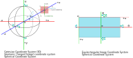
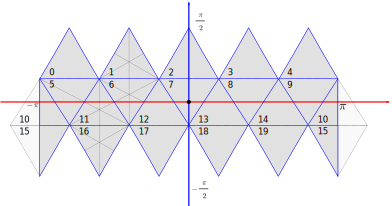
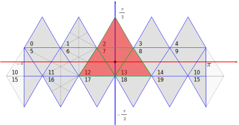

# 1. Convention

## 1.1. Coordinate System

In the Python code, the default coordinate system is same as in OpenCV.

However, the internal coordinate system of the fisheye camera model is different: +x down (!), +y right (!) and +z backward.


In this project, the default equirectangular (Icosahedron Projection) coordinate system is illustrated in the following image.
- *x*, *y* and *z* are the Cartesian coordinates.
- *φ* and *θ* are the spherical coordinates, which are the longitude and latitude, respectively.
- *u* and *v* are the image coordinates, which are the column and row index, respectively.



### 1.1.1. Cartesian coordinate system (3D):

The +x is right, +y is down and +z is forward (right-handed coordinate system), and the origin [0,0,0] is shared with the spherical coordinate system.

### 1.1.2. Gnomonic coordinate system (Tangent Image):

The tangent image show in the image as a pink square.
It is generated using gnomonic projection (xy) is the gnomonic plane coordinate system (normalized coordinate) whose origin is image center, +x is right, +y is up. And the tangent point is the origin of image.

And the uv are the gnomonic image coordinate system whose origin is image top-left.

About the gnomonic projection please reference https://mathworld.wolfram.com/GnomonicProjection.html

### 1.1.3. Spherical coordinate system:

Its origin is shared with the Cartesian coordinate system.
The *θ* axis range is [-π, +π), which is consistent with the x-z plane.
And *φ* axis range is [-0.5π, +0.5π), which is consistent with the y-z plane.

This project also use (longitude, latitude) spherical coordinate system notation, which is same as (*θ*, *φ*).

This project use a special convention introduces in Jump.
https://developers.google.com/vr/jump/rendering-ods-content.pdf

### 1.1.4. Equirectangular Image

The ERP image pixels coordinate origin is Top-Left, and the image row and column index are v and u, is in range [0, width) and [0, hight) respectively.

And the ERP image's spherical coordinate origin at image center, phi (latitude) and theta(theta) is (0,0).
The first pixel 0 is corresponding azimuth -π, and the last pixel image_width - 1 is corresponding +π.
The theta is [-π, +π), phi is [-0.5π, +0.5π].

## 1.2. Icosahedron

The following image show the face index:



## 1.3. Development

Recommended Python code-style convention: [Google Python Style Guide](https://google.github.io/styleguide/pyguide.html)


# 2. Algorithm 
 
There are two methods to aligning disparity maps:
1. **Enumeration:** Enumerate all image pairs whose overlap area is larger than the threshold, to be aligned to a reference disparity map (usually the first dispmap of the input list);
2. **Joint Optimization:** Align all disparity maps together and solve for all parameters jointly.

Each image's weights is  `m*n` matrix. 
*M* is the set of images to be aligned.
For details, please see [`Hedman et al. 2018`](http://visual.cs.ucl.ac.uk/pubs/instant3d/), Section 4.2 and Equations 1 to 8.

The energy function comprises three terms, to solve the deformable alignment parameters for a pair of images:


## 2.1. Enumeration Energy Function

 M_{AB} are all image pairs, each optimization compute the scale and offset between two images.

### 2.1.1. Re-projection Term

The reprojection term 


### 2.1.2. Smooth Term


### 2.1.3. Scale Term


## 2.2. Joint Optimization Energy Function

The energy compute all scale and offset coefficients together.

### 2.2.1. Re-projection Term


### 2.2.2. Smooth Term


### 2.2.3. Scale Term


**Triangles**

First step use 4 triangles images to debug disparity alignment, index 2, 7, 12 and 13.



- save intermediate data to pickle


**Sub-Image index**

In the python code the sub-image index are the icosahedron face order's index.

In the CPP Python module this index will convert to new index for each sub-image base on the sub image data order.
After alignment, the processed disparity map will be rearranged to the original order, transform back to python code.


## 2.3. Gride Size Selection

Current use fixed gride size.

# 3. How to use the code

There are two methods to run the dispmap generation pipeline.
- Executable File: First use python code the generate intermediate file, then call c++ executable file to align them, finally use python to stitch to ERP disparity map.
    Build the c++ project to generate the executable file, and use intermediate file and CLI arguments to transform data and parameters;

- Python Module: Run the whole pipline in python.
    Build the dispmap alignment's Python module, call the alignment function in python.

## 3.1. Runtime Environment

You can both pip and Conda to set up the python runtime environment.

**Pip**

```
pip install torch torchvision torchaudio
pip install colorama matplotlib scipy scikit-image opencv-python
```

**Conda**

```
conda create -p D:\workenv_windows\conda_python3_8_common
conda activate D:\workenv_windows\conda_python3_8_common
conda config --add channels conda-forge
conda install -c conda-forge opencv
conda list --export > packagelist.txt   # export package list
conda install --file packagelist.txt    # install package from package list
```

## 3.2. Executable File

Use the Python code to generate pixels corresponding relation files and disparity maps.
Then use the cpp project `code/cpp` program to load the data and align them and get the align coefficient.

### 3.2.1. Get Intermediate Files

**File Naming**

The original disparity map file base name is the prefix of pixels corresponding file and sub-disparity (RGB) map;

- The sub-rgb image file are *.jpg format, and name with `[0-9a-zA-Z]*_rgb_$0.jpg` the $0 is three digital number image order;

- The sub-rgb image's camera parameters file are *.jpg format, name with `[0-9a-zA-Z]*_cam_$0.json` the $0 is three digital number image order;

- The sub-depth map file are *.pfm format, and name with `[0-9a-zA-Z]*_depth_$0.pfm` the $0 is three digital number image order;

- Pixel corresponding relationship file name with `[0-9a-zA-Z]*_corr_$0_$1_$2.json`. The $0 and $1 are three digital number  image filename, and they are source and target images respectively, $2 is the subimage resolution `width x height`.

- Coefficient filename is "[0-9a-zA-Z]*_coeff.json"

Example:

The original fisheye or ERP rgb image file name is `img_0.jpg`:
- The sub-rgb image file name is `img_0_rgb_000.jpg`, `img_0_rgb_001.jpg`, etc.;
- The camera parameters file name is `img_0_cam_000.json`, `img_0_cam_001.json`, etc.;
- The sub-disparity map file name is `img_0_disp_000.jpg`, `img_0_disp_001.jpg`, etc.;
- The pixel corresponding file name is `img_0_corr_000_001_512x424.json`, `img_0_corr_001_0010_512x424.jpg`, etc..
    And filename `img_0_corr_000_001_512x424.json` stands 000 is source image (Current image), 001 is target image (Reference image), and the image resolution is 512x424. 

**Corresponding file**

The pixels corresponding file 'pixel_corresponding' term size is `[corresponding points_number, 4]`.

And each entry's data order is `[src_y, src_x, tar_y, tar_x]`.
`src_y(x)` is current image pixel location, and `tar_y(x)` is reference image pixel location.

###  3.2.2. Compute scale and offset Coefficients

Use cmake.config set the 3rd libraries path and runtime *.dll files path.

```
--type stitch --root_dir=D:\workspace_windows\InstaOmniDepth\data\depth_stitch_debug\ --method=enum --filename_list=img0_disp_000.pfm,img0_disp_001.pfm
```

The internal function will assign a new index for each disparity maps, so the c++ internal index may be different from the file's original index.


## 3.3. Python Module

Fellow the instruction to build & install python module, call it from python code.

Note:
The python code's numpy array dtype use np.float64, and c++ internal should use cv::Mat 64F deep, by default.

### 3.3.1. Windows

Recommend 3rd libraries version:
Ceres: 2.0.0
Glog: 1.4.0
Gflag: 2.2.2 

**Build C++ DLL**

Modify the libraries path in `cmakeconfig.txt` file, then use CMake configure and build the project.
The generated `code/cpp/bin/disparity_stitch.dll` implement the core of disparity map align, called by python.

**Build/Install python module**

To build the module, open `code/cpp/python/setup.py` and change the dependent lib/include file path.
Change the current directory to `code/cpp/python/` and run `python setup.py build` to build the python bind code.

To install the module to local machine, copy all dependent DLL (OpenCV, Ceres. etc.) to `code/cpp/python/dll` folder.
Then run `python setup.py build install` to copy all pyd and dll to python libraries folder.

**package the python module***

Following all step in "Build/Install python module", except `python setup.py build install`.
Into directory `code/cpp/python/` and run `python setup.py bdist_wheel` to generate the `*.whl` package and output to `code/cpp/python/dist/`.

Note the `*.whl` is platform dependent.

**Debug the Python Module in Windows**

- **Attach to process in MSVC**

Build the solution in Release model, it will generate *.pdb file along with the *.DLL libs.
The *.pyd will generate the *.pdb file too.
The pdb file is used to attach the python.exe process.

1. Add a `std::cin` or `scanf` in front of the code set the breakpoints.
2. The process will suspend at the input instruction, than open the MSVC 'debug'->`attach to a process`;
3. Open the `debug`->`windows`->`Modules` to check whether the *.pdb is loaded;
4. set break point in the source code.


- **Launch in MSCV**

Not recommend.

The Visual Studio 2019 support Python/C++ mixed-mode debugging.
1. CMake build and Visual studio solution;
2. Manually add the python project to the solution.
Add a Python Project to the solution and add the exist python code;
3. Setting the Python Project and Visual studio, https://docs.microsoft.com/en-us/visualstudio/python/working-with-c-cpp-python-in-visual-studio?view=vs-2019
Run the python code in Visual Studio.
Note, link the python38.lib in VS debug model.
4. Build The cmake create a project to build *.pyd file.
The python module build with /MTd, and dll build with /MDd

### 3.3.2. Linux

Build and package the python module firstly, and then install the python module with pip.
The build steps is same as the windows, and copy all the `libdisparity_stitch.so`'s dependent *.so to `code/cpp/python/so/`.
Use `ldd` to find all the dependent libraries and their file path.

Before install new version package, please uninstall it firstly.

**Ubuntu 20.04**

Before run the python code, please add the *.so folder to environment.
The folder is instaOmniDepth's module root folder:
```
export LD_LIBRARY_PATH=$LD_LIBRARY_PATH:/xxxx_workenv/python3_8_xxxx/lib/python3.8/site-packages/instaOmniDepth
```

## 3.4. Stitch Sub-Image

The Python stitch all sub-image to a full image again with the sub-image camera parameters.

## 3.5. TODO list

- [ ] Remove the Eigen from the python/cpp module, replace with OpenCV Mat
- [ ] The python/cpp module implement universal function which accept all kinds of numpy format;
- [ ] The disparity map alignment method api just Numpy as float32 type. Python use float32 numpy array.


## 3.6. Generate debug code

It generate two disparity maps for debug, 

# 4. Document 

## 4.1. Render Latex 

Convert the latex to svg image and output the new markdown file to `temp.md`, and latex equation image saved to `images/markdown_tex`.

```
python -m readme2tex --output temp.md disparity_map_alignment.md  --username xx  --project instaomnidepth  --svgdir images/markdown_tex --nocdn
```

The `readme2tex` install guide https://github.com/leegao/readme2tex.

# 5. FAQ

## 5.1. Build-in MiDaS Module File

If use the build-in MiDaS please download the model form [Google Drive](https://drive.google.com/file/d/1SbsWHTxp4hUTErN0ou2yof1Rrw-8PuNc/view?usp=sharing).

## 5.2. link error when build cpp project '-lCeres::ceres'

This project default use Ceres 2.0.
If your Ceres version is less than 2.0, please modify the CMakeLists.txt file, adding `${CERES_LIBRARIES}` to target_link_libraries, anding `${CERES_INCLUDE_DIRS}` to `target_include_directories` and remove the `Ceres::ceres`.

## 5.3. ERROR: flag 'logtostderr' was defined more than once 

Build with Ubuntu Offical pre-build package will give following error when import the module in python:
ERROR: flag 'logtostderr' was defined more than once (in files 'src/logging.cc' and '/mnt/sda1/libraries_linux/glog/glog-0.3.5/src/logging.cc')
So please build the Ceres, glog & gflag from source code, and use it to build dispmap alignment python module.
